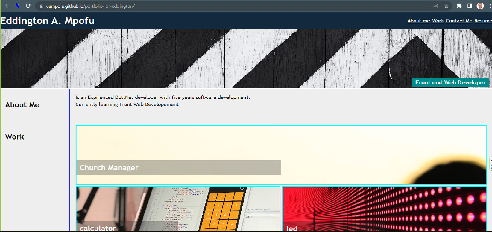

# portfolio

Portfolio website built using HTML

This was a website built to showcase my technical skills, web design skills.

## Project timeline and technologies used

Build a  website to showcase the following:
* My technical skill set
* My web design skill set
*Screen shots

### Technologies Used

* HTML5
* CSS3
* Git
* GitHub

## Usage
you can view the landing page and contact details on :https://eampofu.github.io/portfolio-for-eddington/

## Screen Shots

# Landing Page

